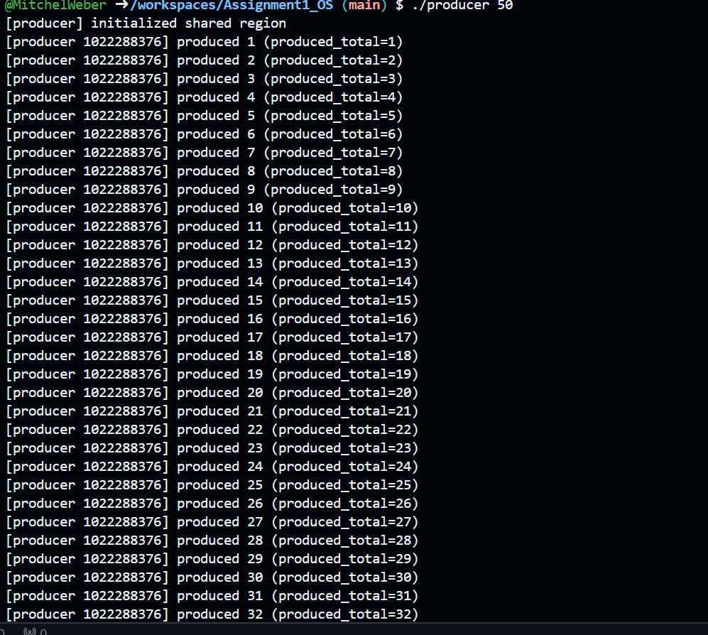
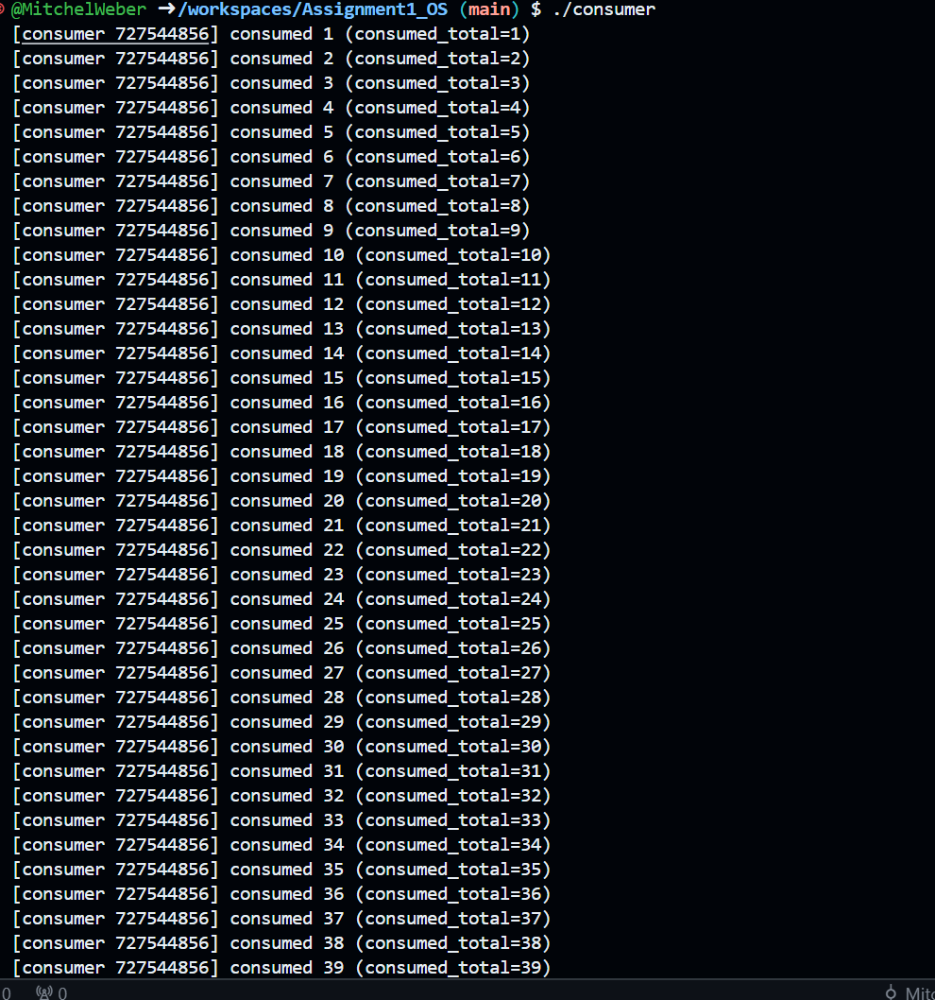

# Producer–Consumer Problem (POSIX Shared Memory and Semaphores)

## Overview
This project implements the classic **Producer–Consumer problem** using **POSIX shared memory** and **semaphores** in C.  
Multiple processes synchronize access to a shared circular buffer stored in shared memory.  
The producer adds items to the buffer, and the consumer removes them while maintaining proper synchronization to prevent race conditions.

---

## Files
```
Assignment1_OS/
├── producer.c     # Creates and writes integers into the shared buffer
├── consumer.c     # Reads and removes integers from the shared buffer
├── cleanup.c      # Cleans up shared memory and semaphore resources
├── Makefile       # Builds all executables
└── README.md      # Project documentation
```

---

## Compilation
Use the provided **Makefile** to compile everything:

```bash
make
```

This will produce three executables:
```
producer
consumer
cleanup
```

To clean up compiled files:
```bash
make clean
```

---

## How to Run

### Step 1 — Run the Producer
In **Terminal 1**, start the producer and specify how many items to produce:
```bash
./producer 50
```
The producer:
- Creates the shared memory region (if it doesn’t already exist)
- Initializes semaphores
- Begins producing items into the buffer

You will see output similar to:
```
[producer] initialized shared region
[producer 1273216168] produced 1 (produced_total=1)
[producer 1273216168] produced 2 (produced_total=2)
```

---

### Step 2 — Run the Consumer
In **Terminal 2**, start the consumer:
```bash
./consumer
```
The consumer attaches to the existing shared memory and starts consuming:
```
[consumer 10000000] consumed 1 (consumed_total=1)
[consumer 10000000] consumed 2 (consumed_total=2)
```

Both processes run concurrently and coordinate using semaphores to avoid conflicts.

---

### Step 3 — Cleanup
After both programs finish or are stopped with `Ctrl + C`, release shared memory and semaphores:
```bash
./cleanup
```
This ensures no leftover shared memory or semaphore objects remain in the system.

---

## Design Details
- **Shared Memory:** Stores the circular buffer and control variables (head, tail, count).
- **Semaphores:**
  - `mutex` — Ensures mutual exclusion when accessing the buffer.
  - `full` — Counts the number of full slots.
  - `empty` — Counts the number of empty slots.
- **Synchronization:**  
  - The producer waits if the buffer is full (`empty == 0`).  
  - The consumer waits if the buffer is empty (`full == 0`).  
  - Mutual exclusion ensures no two processes modify the buffer simultaneously.

---

## Example Run (Two-Terminal Setup)

**Terminal 1 (Producer):**
```
$ ./producer 10
[producer] initialized shared region
[producer 12345] produced 1 (produced_total=1)
...
```

**Terminal 2 (Consumer):**
```
$ ./consumer
[consumer 67890] consumed 1 (consumed_total=1)
...
```

**Cleanup:**
```
$ ./cleanup
[cleanup] resources removed successfully
```

---

## Notes
- You **must** run both producer and consumer simultaneously for the program to demonstrate synchronization.
- If the producer is closed early, the consumer will wait until data becomes available or until the shared memory is removed.
- Always run `./cleanup` after testing to remove shared resources.

---

## Example Results

**Producer Output:**


**Consumer Output:**


**Cleanup Output:**


---

## Author
**Mitchel Weber**  
CS 33211 — Operating Systems  